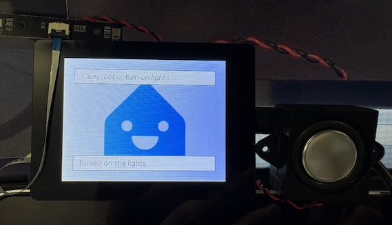

# OpenNextion ESPHome Voice Assistant

[](./README.md)
[](./README.zh-CN.md)

<p align="center">
  
</p>

OpenNextion ESPHome Voice Assistant is a Home Assistant voice satellite project
for OpenNextion ESP32-S3 display boards. It ports the official
[ESPHome wake-word voice assistants](https://github.com/esphome/wake-word-voice-assistants)
example to OpenNextion hardware, with touchscreen status UI, microphone input,
speaker output, Wi-Fi provisioning, local wake word detection, and timer alarm
handling.

Default wake word: **Okay Nabu**

## Supported Boards

The public `v0.1.2` release targets two OpenNextion ESP32-S3 display boards:

| Display model | Size | Resolution | Display driver | ESPHome YAML | Status |
| --- | --- | --- | --- | --- | --- |
| [ONX3248G035][onx3248g035] | 3.5 inch | 320 x 480 | ST7796U | `OpenNextion/ONX3248G035/onx3248g035.yaml` | Verified |
| [ONX2432G028][onx2432g028] | 2.8 inch | 240 x 320 | ST7789 | `OpenNextion/ONX2432G028/onx2432g028.yaml` | Verified |

The boards expose microphone and speaker interfaces, but microphone and speaker
modules are not directly included with the boards. The board reference links
include OpenNextion microphone and speaker module information and purchase links
as optional accessory references; other compatible microphone and speaker
hardware can also be used.

Do not flash firmware built for one display model onto the other display model.

## Quick Start

1. Download the matching `.factory.bin` file for your board from
   [GitHub Releases][release-downloads].
2. Flash the factory binary from address `0x0`.
3. If the device cannot connect to a known Wi-Fi network, connect to its
   fallback ESPHome access point.
4. Open `http://192.168.4.1/` if the captive portal does not open automatically.
5. Select your 2.4 GHz Wi-Fi network and enter the password.
6. Add the ESPHome device in Home Assistant when it is discovered.
7. Configure Home Assistant Assist and select a voice pipeline.
8. Say **Okay Nabu** to start using the voice assistant.

Use a stable 2.4 GHz network for voice assistant use. Weak signal or roaming
scans can delay TTS streaming and make playback choppy.

## Firmware Download and Flashing

Download firmware from the GitHub Releases page. ESPHome factory binaries are
intended for full initial flashing from address `0x0`.

| Target | Firmware file | Version | Flash address |
| --- | --- | --- | --- |
| [onx3248g035][release-downloads] | `opennextion-esphome-voice-assistant-v0.1.2-onx3248g035.factory.bin` | `v0.1.2` | `0x0` |
| [onx2432g028][release-downloads] | `opennextion-esphome-voice-assistant-v0.1.2-onx2432g028.factory.bin` | `v0.1.2` | `0x0` |

Flash a factory binary with:

```bash
python -m esptool --chip esp32s3 -p /dev/cu.wchusbserial1110 -b 921600 write_flash \
  0x0 ./opennextion-esphome-voice-assistant-v0.1.2-onx2432g028.factory.bin
```

Replace the serial port and firmware file name as needed for your board. For
this release, full firmware flashing is recommended. OTA firmware downloads are
not provided unless the OTA flow is separately validated.

## Home Assistant Usage

After Wi-Fi provisioning, Home Assistant should discover the ESPHome device on
the same network. Add the device, then configure an Assist voice pipeline with
speech-to-text, conversation, and text-to-speech services.

The device provides:

- Local wake word detection with `micro_wake_word`
- PDM microphone input for Home Assistant speech-to-text
- I2S speaker output for Home Assistant text-to-speech responses
- Touchscreen status UI for listening, thinking, replying, error, mute, and timer states
- Touch-to-stop behavior for Home Assistant Assist timer alarms

## Background

I wanted to adapt the OpenNextion development boards I had on hand into Home
Assistant voice assistant input and output devices. The official Home Assistant
documentation introduced the ESPHome wake-word voice assistant project, so I
forked that project and added support for my OpenNextion boards.

OpenNextion boards are a good fit for this kind of DIY Home Assistant voice
assistant project because they combine ESP32-S3, an SPI TFT display, capacitive
touch, microphone input, speaker output, and published hardware reference files
on a compact development board. This makes it easier to build an interactive
voice satellite with both visual feedback and touch control, instead of wiring a
display, touch panel, audio input, and audio output from scratch.

## 3D Printed Enclosure

I also designed simple 3D printed enclosures for the supported OpenNextion
display sizes and will publish them on MakerWorld. Anyone who needs them can
download and print them for free.

Each enclosure should match the corresponding OpenNextion display size and leave
space for the microphone and speaker wiring used by the voice assistant setup.

MakerWorld project links:

- 3.5 inch ONX3248G035 enclosure: link to be added
- 2.8 inch ONX2432G028 enclosure: link to be added

## Current Porting Work

This version is based on ESPHome wake-word voice assistants and adds OpenNextion
multi-board support. The main changes are:

### 1. OpenNextion Board Support

OpenNextion ESPHome Voice Assistant includes dedicated ESPHome YAML
configurations for:

- [ONX3248G035][onx3248g035] 3.5 inch display
- [ONX2432G028][onx2432g028] 2.8 inch display

The OpenNextion configurations are grouped under `OpenNextion/` to avoid adding
one top-level directory per board model as the series grows.

### 2. Display, Touch, and Audio Hardware

The port adds the OpenNextion hardware initialization required by the supported
boards:

- ST7796U SPI TFT panel support for ONX3248G035
- ST7789 SPI TFT panel support for ONX2432G028
- BGR color order for the supported panels
- CST826 capacitive touch support on the shared I2C bus
- PDM microphone input on GPIO19 / GPIO20
- I2S speaker output on GPIO16 / GPIO14 / GPIO15
- PCF8574 IO expander support for LCD reset and speaker amplifier control
- Backlight GPIO setup

### 3. Voice Assistant UI and Timer Behavior

The port keeps the original ESPHome voice assistant UI flow and adapts it to the
OpenNextion displays:

- Listening, thinking, replying, error, mute, and timer-finished display states
- ESPHome speaker media player for text-to-speech playback
- Home Assistant Assist timer alarm playback on the device
- Touch-to-stop behavior for timer alarms
- ESPHome fallback AP and captive portal Wi-Fi provisioning

## Current Validation Status

### Display Validation

<p align="center">
  
</p>

- ONX3248G035 has been validated on real hardware
- ONX2432G028 has been validated on real hardware
- Display output has been validated on both OpenNextion boards
- CST826 touch input has been validated on both OpenNextion boards
- PDM microphone input has been validated with Home Assistant Assist
- I2S speaker output has been validated with Home Assistant TTS responses
- Local wake word detection has been validated with the configured model
- Assist timers can ring on the device and be stopped by touching the screen

### Firmware Validation Matrix

Legend: ✅ Verified / ⚠️ Partially verified or hardware-dependent / ⏳ Not used

| Board | Build | Boot | Display | Touch | Microphone | Speaker | Assist flow | Timer alarm | Notes |
| --- | --- | --- | --- | --- | --- | --- | --- | --- | --- |
| ONX3248G035 | ✅ Verified | ✅ Verified | ✅ Verified | ✅ Verified | ✅ Verified | ✅ Verified | ✅ Verified | ✅ Verified | 3.5 inch ST7796U display |
| ONX2432G028 | ✅ Verified | ✅ Verified | ✅ Verified | ✅ Verified | ✅ Verified | ✅ Verified | ✅ Verified | ✅ Verified | 2.8 inch ST7789 display |

## Build from Source

The main installation path is to use release binaries. If you want to customize
or rebuild the ESPHome firmware locally, see [Build from Source](docs/build-from-source.md).

That document includes ESPHome Device Builder layout notes, `esphome config`,
`esphome compile`, `esphome run`, `esphome logs`, and the location of generated
`firmware.factory.bin` files.

## Roadmap

Planned next steps:

- Keep this OpenNextion fork aligned with upstream ESPHome wake-word voice assistants where practical
- Continue tracking the upstream OpenNextion board support pull requests
- Add more photos and validation images for the supported boards
- Publish convenient release firmware binaries when the release flow is ready
- Continue adding support for more OpenNextion ESP32-S3 display boards

## Credits

This project is based on ESPHome wake-word voice assistants. Thanks to the
original project and the related open source projects.

- ESPHome wake-word voice assistants: https://github.com/esphome/wake-word-voice-assistants
- Home Assistant: https://www.home-assistant.io/
- ESPHome: https://esphome.io/
- OpenNextion open source projects: https://github.com/OpenNextion
- OpenNextion board documentation: https://nextion.tech/wiki/

## License

This project preserves the upstream ESPHome wake-word voice assistants license
terms. See `LICENSE` for details. Third-party libraries, ESPHome components, and
Home Assistant integrations may have their own license notices.

## Disclaimer

This project is not an official Home Assistant, ESPHome, or OpenNextion product.

Flashing and using third-party firmware involves risk. Please make sure the
selected firmware matches your exact OpenNextion board model before flashing.
This project is not responsible for device damage, data loss, network connection
issues, Home Assistant configuration issues, voice assistant behavior, or any
other consequences of use.

[onx2432g028]: https://github.com/OpenNextion/OpenNextion-SKU-ONX2432G028
[onx3248g035]: https://github.com/OpenNextion/OpenNextion-SKU-ONX3248G035
[release-downloads]: https://github.com/OpenNextion/OpenNextion-Example-wake-word-voice-assistants/releases
